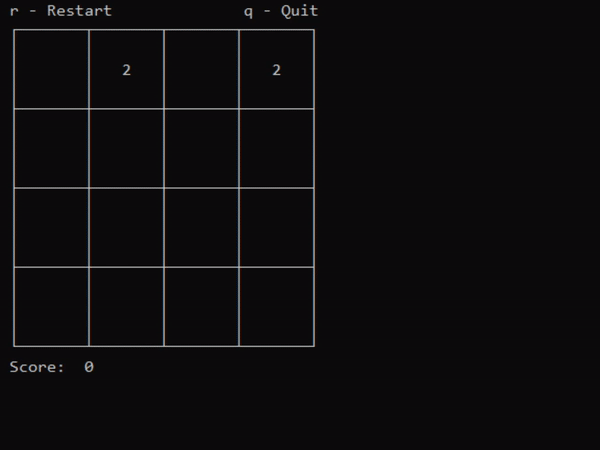

# 2048 Curses

## Overview
A text-based 2048 game for the terminal written in C with [curses](https://en.wikipedia.org/wiki/Curses_(programming_library)).

## Features
- Controls using WASD or arrow keys
- Customizable board size by editing macros
- Basic color support
- Score tracking

## Project Requirements
A compatible curses library. Tested on Windows using [PDCurses v3.9](https://github.com/wmcbrine/PDCurses) by William McBrine.

## License
Licensed under [MIT](LICENSE).
